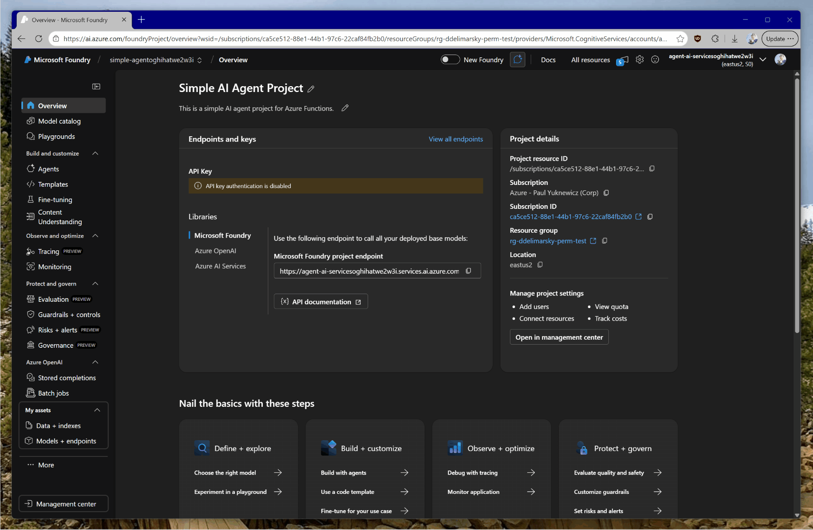
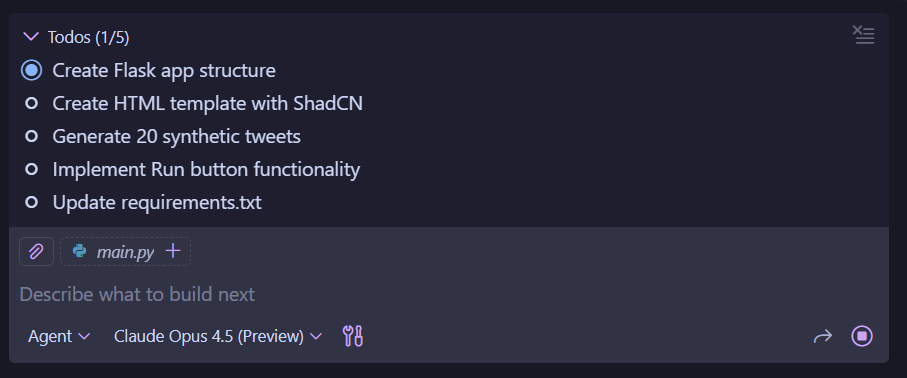

# Introduction to Vibe Coding for Microsoft Foundry Agents

These are the simplest instructions for creating a project and running an AI Agent with Microsoft Foundry. The goal is to get you started as quickly as possible with a minimalist agent, along with baseline instructions to vibe code a suitable web-based frontend.

## Phase 1: Create the Project (Foundry + Azure resources needed)

>[!NOTE]
>All paths start here. This sets up the cloud resources required for the rest of the exercise.

[](https://portal.azure.com/#create/Microsoft.Template/uri/https%3A%2F%2Fraw.githubusercontent.com%2Fpaulyuk%2Fsimple-agent-af%2Fmain%2Finfra%2Fdeploybutton%2Fazuredeploy.json)

1. **Click** the "Deploy to Azure" button above
2. **Sign in** with your Azure credentials
3. **Configure:**
   * **Region:** Select **East US 2** (or your preferred region)
   * **Environment Name:** Enter `vibe-agent-offsite` (or your preferred name)
4. **Deploy:** Click **Review + Create**, then **Create**

>[!IMPORTANT]
>Make sure that you are selecting an Azure subscription you have write access to.

>[!NOTE]
>Provisioning can take 2-3 minutes.

**What gets created:**

* **Resource Group:** `rg-<your-environment-name>` (e.g., `rg-vibe-agent-offsite`)
* **Model Deployment:** Named `chat` using GPT-4.1-mini
* **Azure AI Foundry Project:** Named `simple-agent-<unique-id>`

Go to [Foundry Portal](https://ai.azure.com) and look for your project starting with **simple-agent** (view All Resources if needed). Alternatively, look for the resource group mentioned above to find all the relevant resources.

## Phase 2: Build the Agent

Choose your path - with code focus or the portal

### Path A: The Code (Developer Experience using Agent Framework)

***Best for**: Understanding SDK implementation and running locally.*

#### 1. Gather Your Credentials

Before running code, you need two values from your Azure/Foundry settings:

* **Azure OpenAI Endpoint:** (e.g., `https://<your-resource>.openai.azure.com/`)
* **Deployment Name:** (The name of the model you deployed, e.g., `chat`)

The endpoint we want for Agent Framework is the Azure OpenAI one.



E.g. a valid endpoint looks like:

```shell
https://agent-ai-servicesou6taoycpkkwc.openai.azure.com/
```

>[!IMPORTANT]
>Make sure that you are **not using** the _New Foundry_ portal to quickly get the Azure OpenAI endpoint.

#### 2. Configure Environment Variables

Copy the block matching your OS into your terminal to set the variables for the current session.

**PowerShell**

```powershell
$env:AZURE_OPENAI_ENDPOINT = "https://<your-foundry-project-id>.openai.azure.com/"
$env:AZURE_OPENAI_DEPLOYMENT_NAME = "chat"
```

**macOS / Linux**

```bash
export AZURE_OPENAI_ENDPOINT="https://<your-foundry-project-id>.openai.azure.com/"
export AZURE_OPENAI_DEPLOYMENT_NAME="chat"
```

#### 3. Run the Agent

##### Option 1: Python

* **Repo:** [https://github.com/paulyuk/simple-agent-af-python](https://github.com/paulyuk/simple-agent-af-python)

1. Clone the repository.
2. Open your terminal to the repo folder.
3. Run the environment variable commands from [Step 2](#2-configure-environment-variables).
4. Create a new virtual environment in the project folder: `python -m venv .venv`
5. Activate the virtual environment.
    1. On Windows: `.\.venv\Scripts\activate`
    1. On Linux/macOS: `source .venv/bin/activate`
6. Install required packages: `pip install -r requirements.txt`
7. Run the code: `python main.py`

Refer to the [project `README`](https://github.com/paulyuk/simple-agent-af-python/blob/main/README.md) for additional details.

##### Option 2: C# / .NET

* **Repo:** [https://github.com/paulyuk/simple-agent-af](https://github.com/paulyuk/simple-agent-af)

1. Clone the repository.
2. Open your terminal to the repo folder.
3. Run the environment variable commands from [Step 2](#2-configure-environment-variables).
4. Follow the `README.md` to run the app (`dotnet run`).

You will know the agent is running successfully if you can have it answer your questions in the terminal.

### Path B: The Portal UX (No-Code using Agent Service)

***Best for**: Rapid prototyping, testing prompts, and visual verification.*

1. **Enter Agent Builder:** In your new project, look at the left-hand navigation menu and click **Agents**.
2. **Create:** Click **+ Create Agent**.
3. **Setup:**
   * **Name:** Give your agent a name.
   * **Model:** Select `gpt-4.1-mini` from the dropdown. *If no model is listed, click "Connect & deploy" to add one named `gpt-4.1-mini`.*
   * **Instructions:** Type a simple system prompt (e.g., "You are a helpful project management assistant.").
4. **Test:** Use the **Playground** chat window on the right to type a message and verify the response.

#### 4. Configure the agent

For the agent that you are using, modify the **instructions** in the code (or portal) to fit the scenario at hand (e.g., agent responsible for triaging customer support tickets). For example:

```text
You are a Microsoft Support bot responding to customer tweets on Twitter/X.

When a customer tweets at @MicrosoftHelps, respond helpfully and professionally.

The customer's tweet is: {{tweet}}

Write a helpful response.
```

The instructions, in this context, are the system prompt.

## Phase 3: Build the frontend

With the agent available, we can now start working on a frontend that will allow us to _evaluate_ the performance of the agent. For simplicity, we will be using Python, Flask, and the [starter Python project](https://github.com/paulyuk/simple-agent-af-python) as inspiration.

>[!NOTE]
>You can also use any other framework or technology stack. For the purposes of this exercise, we will be focusing on the _outcomes_ rather than the logistics of getting there.

Open the sample starter Python project in Visual Studio Code. Because this is a Python project, we will need to make sure that the [Python configuration steps](#option-1-python) have been completed. We will also use **Claude Opus 4.5** model with GitHub Copilot.

Open the `main.py` file (the sample agent), then open the Chat view and enter the following prompt:

```text
Using this file as inspiration, we want to build a Flask-based web frontend application that will be used to test the effectiveness of our agent. The frontend is a single-page application that has two columns:

1. System prompt - this is where we will set the instructions for the agent.
2. Tweets - you will generate 20 synthetic tweets as if they are tagging @MicrosoftHelps for support questions or complaints about Microsoft products.

For the tweet column, I want every tweet to be in its own row, with a "Run" button that allows me to test the system prompt against the tweet, and then within the same row (that can expand down) provide the output from the model on the given tweet.

Use ShadCN for the UI/CSS, and dark theme.
```

The more detailed the initial instructions - the better. You can, of course, use tools like [GitHub Spec Kit](https://github.com/github/spec-kit) to make this process a bit more deterministic, but it will also be a much more heavyweight process.

