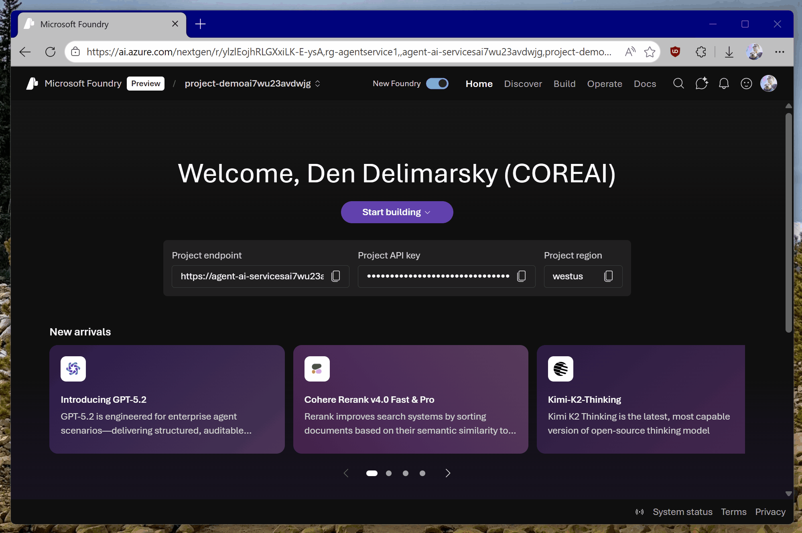
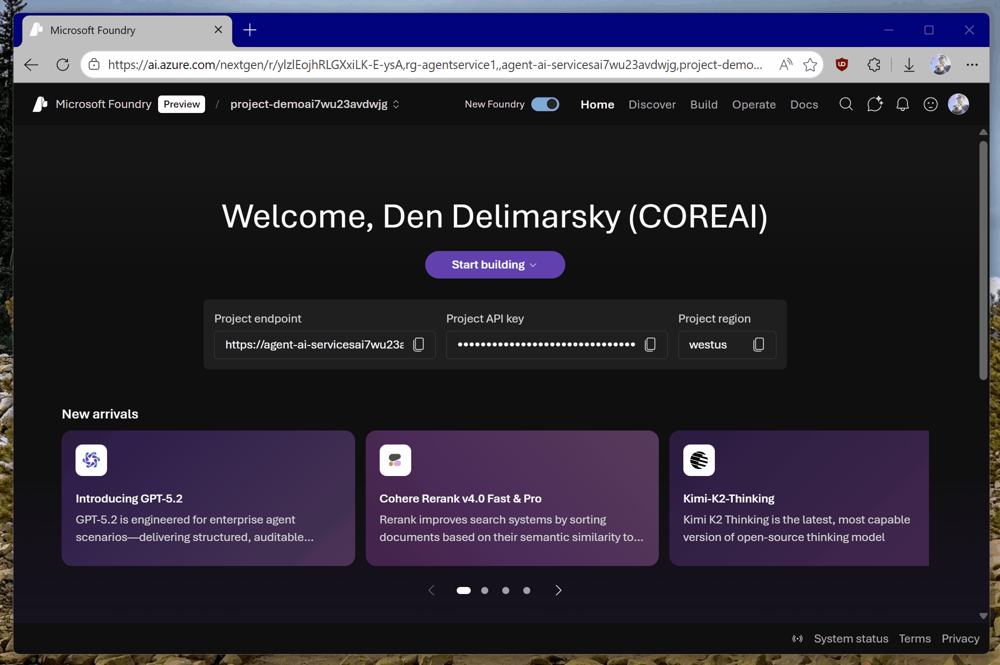

# Introduction to Vibe Coding for Agents with Microsoft Foundry

These are the basic instructions for creating a project and running an AI Agent on top of Microsoft Foundry.

## Step 1: Create the Project

>[!NOTE]
>All paths start here. This sets up the cloud resources.

1. **Navigate:** Go to the [Microsoft Foundry Portal](https://ai.azure.com).
2. **Login:** Sign in with your Azure credentials.
3. **Create:** Click the **Create new project** button.
4. **Configure:**
   * **Project name:** Enter a simple name (e.g., `ai-agent-demo`).
5. **Finish:** Click **Create**.
   * *Note: It may take 1-2 minutes to provision.*



>[!NOTE]
>You might already have a project created that you can use, so you won't need to create one from scratch. Additionally, if you need to select a specific subscription or resource group, expand **Advanced options** and select the right assets.

## Step 2: Build the Agent

Choose your path - through code or via the Foundry poral.

### Path A: The Code (Developer Experience using Agent Framework)

*Best for: Understanding SDK implementation and running locally.*

#### 1. Gather Your Credentials

Before running code, you need two values from your Foundry settings:

* **Endpoint:** (e.g., `https://<your-resource>.openai.azure.com/`)
* **Deployment Name:** (The name of the model you deployed, e.g., `gpt-4.1-mini`)

You can obtain these from the deployment details view:



#### 2. Configure Environment Variables

Copy the block matching your OS into your terminal to set the variables for the current session.

**PowerShell**

```powershell
$env:AZURE_OPENAI_ENDPOINT = "https://agent-ai-NNNNN.openai.azure.com/"
$env:AZURE_OPENAI_DEPLOYMENT_NAME = "gpt-4.1-mini"
```

**Bash**

```bash
export AZURE_OPENAI_ENDPOINT="https://agent-ai-NNNNN.openai.azure.com/"
export AZURE_OPENAI_DEPLOYMENT_NAME="gpt-4.1-mini"
```

>[!NOTE]
>Replace `https://agent-ai-NNNNN...` with your actual endpoint URL.

#### 3. Run the Agent

**Option 1: Python**
* **Repo:** [https://github.com/paulyuk/simple-agent-af-python](https://github.com/paulyuk/simple-agent-af-python)

1. Clone the repository.
2. Open your terminal to the repo folder.
3. Run the environment variable commands from Step 2.
4. Follow the `README.md` to install dependencies in a venv and run the agent script (`python main.py`).

**Option 2: C# / .NET**
* **Repo:** [https://github.com/paulyuk/simple-agent-af](https://github.com/paulyuk/simple-agent-af)

1. Clone the repository.
2. Open your terminal to the repo folder.
3. Run the environment variable commands from Step 2.
4. Follow the `README.md` to run the app (`dotnet run`).

---

### Path B: The Portal UX (No-Code using Agent Service)
*Best for: Rapid prototyping, testing prompts, and visual verification.*

1. **Enter Agent Builder:** In your new project, look at the left-hand navigation menu and click **Agents**.
2. **Create:** Click **+ Create Agent**.
3. **Setup:**
   * **Name:** Give your agent a name.
   * **Model:** Select `gpt-4.1-mini` from the dropdown. *If no model is listed, click "Connect & deploy" to add one named `gpt-4.1-mini`.*
   * **Instructions:** Type a simple system prompt (e.g., "You are a helpful project management assistant.").
4. **Test:** Use the **Playground** chat window on the right to type a message and verify the response.